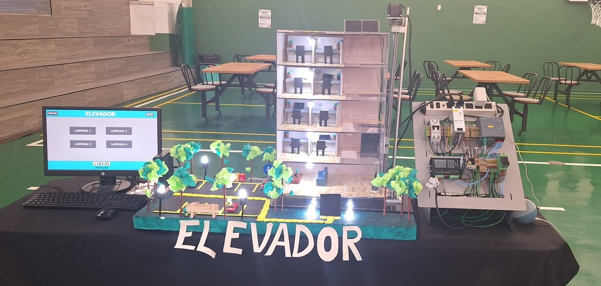
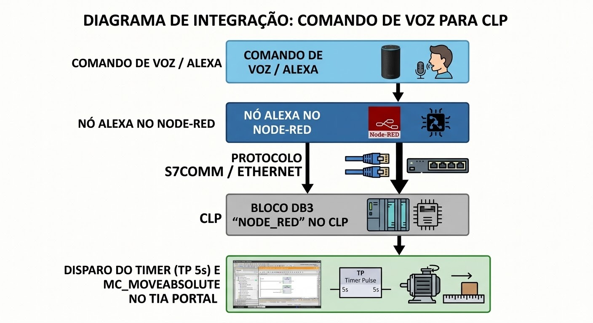
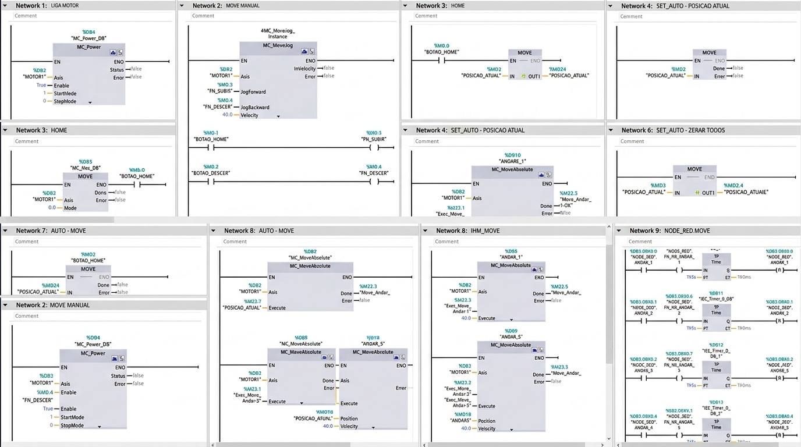
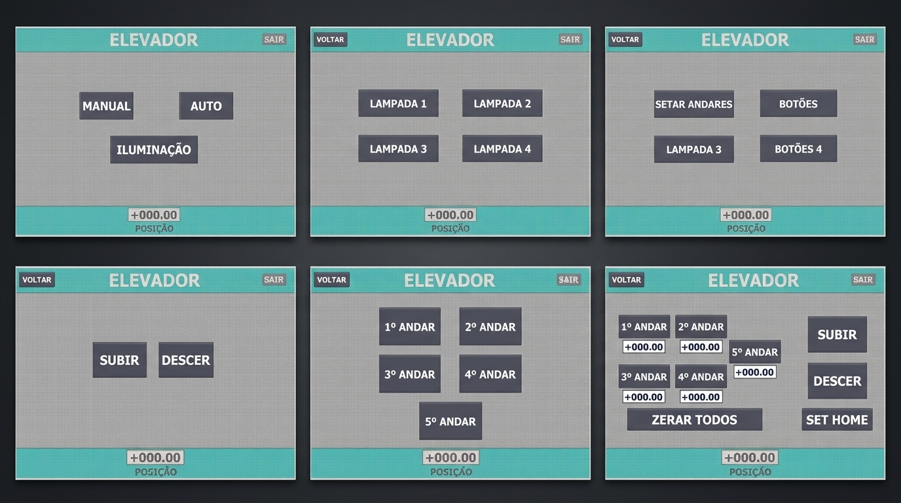
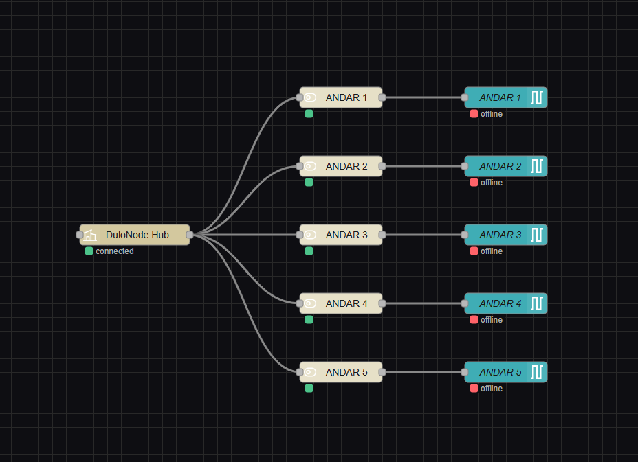

# 🛗 Elevador Automatizado com CLP Siemens S7-1200 e Controle por Voz via Alexa para Acessibilidade


---

## 📋 Resumo Executivo

Este projeto apresenta o desenvolvimento e a implementação de uma maquete de elevador automatizado de múltiplos andares, projetado sob os conceitos de **Design Inclusivo** e **Automação Industrial**. O objetivo central é oferecer uma solução de acessibilidade voltada para pessoas com deficiência visual, restrições motoras ou limitações temporárias para acionamento de botões físicos, além de proporcionar praticidade em situações do cotidiano em que o usuário está com as mãos ocupadas (como carregando sacolas de compras).

O controle do sistema é executado por um Controlador Lógico Programável (CLP) **Siemens S7-1200 (CPU 1212C DC/DC/DC)**. O controle de parada e posicionamento dos andares é parametrizado via IHM no computador, na qual o operador define e armazena os *setpoints* de coordenadas/passos diretamente em Tags de memória do CLP, orientando a geração de pulsos e direção para um driver **DM556** acoplado ao motor de passo e ao sistema mecânico de fuso com guia linear.

A camada de acessibilidade e inteligência IoT é viabilizada pelo **Node-RED**, que estabelece a comunicação bidirecional entre o CLP e a **Amazon Alexa**, permitindo a chamada dos andares e o monitoramento do sistema totalmente por comando de voz. O resultado é um protótipo funcional, flexível e focado na convergência entre tecnologia industrial e inclusão social.

> 📷 ** Maquete Física do Elevador e Painel de Automação **
> 
> 

---

## 🎯 Visão Geral e Objetivos

### 🌐 Visão Geral
A maioria dos elevadores depende exclusivamente de botoeiras físicas para a navegação entre os andares. Essa abordagem tradicional cria barreiras diretas de uso para pessoas cegas, com deficiência visual ou limitações motoras. Além disso, mesmo no uso cotidiano, o acionamento por botões se mostra inconveniente em situações simples, como ao carregar sacolas ou caixas.

A proposta deste projeto é unir a confiabilidade da automação industrial — utilizando o CLP Siemens S7-1200 e motor de passo — ao acionamento por voz via Amazon Alexa, além de uma IHM no computador para parametrização. Com essa estrutura, o elevador funciona de forma totalmente *hands-free* (sem uso das mãos), eliminando a dependência de botões físicos e oferecendo uma alternativa acessível para qualquer perfil de usuário.

> 📷 ** Diagrama de Integração do Sistema **
> 
> 

### 🎯 Objetivos
* **Objetivo Geral:** Desenvolver um protótipo de elevador automatizado focado em acessibilidade, utilizando controle por voz e posicionamento parametrizável por software.
* **Posicionamento Flexível via IHM:** Permitir a definição e a calibração das posições de cada andar diretamente pela interface do computador, salvando os valores em Tags de memória no CLP Siemens S7-1200 sem a necessidade de reposicionar componentes mecânicos ou sensores físicos.
* **Acessibilidade por Voz via IoT:** Criar a rotina de comunicação no Node-RED para integrar a Amazon Alexa ao CLP, convertendo comandos falados (como *"Alexa, vá para o primeiro andar"*) em chamadas executáveis pelo sistema.

---

## 🛠️ Arquitetura de Hardware e Especificações

### 📦 Lista de Componentes Utilizados

| Componente | Modelo / Especificação | Função no Sistema |
| :--- | :--- | :--- |
| **Controlador Lógico Programável (CLP)** | Siemens S7-1200 (CPU 1212C DC/DC/DC) | Processamento da lógica, armazenamento de Tags de posição e controle de movimento. |
| **Driver de Motor de Passo** | DM556 | Controle de corrente e micropassos para o motor. |
| **Motor de Passo** | OceanTech OT-HB1013 | Tracionamento mecânico do conjunto de elevação. |
| **Mecanismo de Transmissão** | Fuso trapezoidal / esferas + Guia Linear | Sustentação e deslocamento vertical preciso do carrinho da cabine. |
| **Sinalização Visual** | Lâmpadas LED 12V (Soquete tipo pino/baioneta) | Indicação luminosa do andar atual do elevador. |
| **Fonte de Alimentação Principal** | Fonte Industrial Balluff (24V DC) | Alimentação do CLP Siemens, do driver DM556 e circuitos de controle. |
| **Fonte de Alimentação Auxiliar** | Fonte 12V DC | Alimentação exclusiva para o circuito das lâmpadas LED de sinalização. |
| **Interface e Conectividade** | PC (IHM / TIA Portal) e Servidor Node-RED | Configuração das posições dos andares no CLP e ponte IoT com a Alexa. |

### ⚡ Mapeamento de Sinais e Distribuição de Potência
* **Barramento de 24V DC (Fonte Balluff):** Responsável por alimentar a CPU S7-1200, as entradas/saídas do CLP e a etapa de potência de controle do driver DM556, garantindo estabilidade contra ruídos elétricos.
* **Barramento de 12V DC:** Circuito independente acionado via saídas do sistema para comutar a iluminação das lâmpadas LED nos pavimentos.
* **Sinais de Comando de Movimento:**
  * **Saída de Pulso (`PUL` / `Q0.0`):** Envia o trem de pulsos do CLP para o driver com a frequência proporcional à velocidade desejada.
  * **Saída de Direção (`DIR` / `Q0.1`):** Define o sentido de rotação do motor de passo (nível alto para subida, nível baixo para descida).
* **Interface de Comunicação PROFINET:** Conexão de rede Ethernet entre o CLP, a IHM no computador e a aplicação Node-RED.

---

## 📐 Projeto CAD 3D e Execução Mecânica

### 💻 Modelagem Tridimensional (CAD)
* **Concepção e Dimensionamento:** O projeto mecânico foi totalmente modelado no SolidWorks 2025 antes da fabricação, permitindo validar o curso útil da cabine, o posicionamento do fuso, os pontos de fixação das guias lineares e a folga para o motor de passo.
* **Precisão de Montagem:** A modelagem prévia garantiu a perfeita concentricidade entre o eixo do motor de passo e o fuso, prevenindo desalinhamentos, vibrações ou perdas de passo durante o deslocamento.

### ⚙️ Fabricação e Usinagem CNC
* **Seleção do Material:** A estrutura principal da maquete foi construída em **policarbonato**, escolhido pela elevada resistência mecânica a impactos, rigidez estrutural e transparência — permitindo a visualização clara dos mecanismos internos e da movimentação do elevador.
* **Corte em Router CNC:** As peças em policarbonato foram usinadas via fresadora CNC a partir do projeto 3D. O processo fabril garantiu tolerâncias dimensionais exatas nos furos de fixação, nos encaixes da estrutura e nos suportes das guias lineares.

> 📷 ** Projeto CAD 3D no SolidWorks **
> 
> 

---

## 💻 Automação e Software

### 🧩 Lógica de Controle no TIA Portal (Motion Control & Ladder)

A programação do CLP Siemens S7-1200 foi desenvolvida em linguagem Ladder no TIA Portal, utilizando os blocos nativos de tecnologia e controle de movimento (*Motion Control*):

* **Organização dos Blocos:**
  * **`OB1 (Main)`:** Bloco de execução principal que gerencia o ciclo do programa e chama a rotina de controle do motor (`FB2 - MOTOR BLOCK`) e a rotina de iluminação (`FB1 - LAMPADAS`).
  * **`FB2 (MOTOR BLOCK)`:** Bloco responsável pelo acionamento do eixo de movimento (`MOTOR1` / eixo PTO). Contém as instruções `MC_Power` (habilita o driver), `MC_MoveJog` (movimentação manual de subida/descida), `MC_Home` (zeramento de referência) e `MC_MoveAbsolute` (deslocamento absoluto para os 5 andares cadastrados).
  * **`FB1 (LAMPADAS)`:** Controla o acionamento das 4 lâmpadas de sinalização. Utiliza portas lógicas para permitir que as lâmpadas sejam ligadas tanto pelos botões da IHM (`IHM_LAMPADA_x`) quanto pelos comandos vindos do Node-RED.

> 📷 ** Lógica Ladder no TIA Portal **
> 
> `

---

### 🖥️ Interface Homem-Máquina (IHM)

A IHM foi estruturada para oferecer navegação simples e controle completo sobre a operação do elevador:

* **Tela Inicial (Início):** Dá acesso às opções `MANUAL`, `AUTO` e `ILUMINAÇÃO`, exibindo no rodapé a leitura contínua da variável `%MD2` (`POSIÇÃO` atual em tempo real).
* **Tela Manual:** Contém os botões `SUBIR` e `DESCER` para movimentação via `MC_MoveJog`, útil para ajustes finos de posicionamento.
* **Tela Iluminação:** Apresenta seletores individuais para acionamento das lâmpadas dos andares (`LÂMPADA 1` a `LÂMPADA 4`).
* **Menu Automático (`AUTO`):**
  * **Tela "Setar Andares":** O operador posiciona a cabine no andar desejado utilizando os botões de ajuste manual (`SUBIR`/`DESCER`) e pressiona o botão de gravação correspondente (ex: `1º ANDAR`, `2º ANDAR`, etc.). O comando `MOVE` copia o valor de `%MD2` (`POSICAO_ATUAL`) para a Tag de memória referente àquele andar (`ANDAR1` = `%MD6`, `ANDAR2` = `%MD10`, etc.). Há também a função `ZERAR TODOS` para resetar os *setpoints*.
  * **Tela "Botões" (Chamada de Andares):** Permite acionar o deslocamento automático para qualquer um dos 5 andares cadastrados. Ao clicar no andar, o CLP dispara o bloco `MC_MoveAbsolute` associado àquela coordenada.

> 📷 **[ Telas da Interface Homem-Máquina (IHM) ]**
> 
> 

---

### 🌐 Integração IoT com Node-RED e Amazon Alexa

* **Tradução de Comandos de Voz:** O servidor Node-RED recebe o gatilho da Amazon Alexa (ex: *"Alexa, vá para o andar 3"*) e escreve diretamente nos bits do Data Block de comunicação (`DB3 - NODE_RED`) via protocolo S7Comm.
* **Tratamento de Pulso e Execução:** Na Network 9 do TIA Portal, a recepção do sinal da Alexa ativa um temporizador `TP` (duração de 5s) que gera o pulso de acionamento (`FN_NR_ANDAR_x`) e limpa o bit de entrada do Node-RED para prevenir retenções de comando.
* **Priorização Paralela:** Na Network 10, uma porta lógica "OU" une o comando da IHM (`FN_MoveAndar_x`) ao comando do Node-RED (`FN_NR_ANDAR_x`), garantindo que o elevador atenda à solicitação vinda de qualquer uma das duas interfaces.

> 📷 **[ PRINT: Fluxo de Comunicação no Node-RED ]**
> 
> *Substitua este bloco pelo print do fluxo do Node-RED:*
> 

---

## ⚠️ Desafios Técnicos e Soluções

| Desafio Técnico | Causa Raiz | Solução Aplicada |
| :--- | :--- | :--- |
| **Retenção do Sinal de Voz (Alexa/Node-RED)** | A escrita direta via protocolo S7Comm mantinha o bit ativo na memória do CLP, causando disparos contínuos da movimentação. | Criação de uma rotina com temporizador de pulso (`TP` de 5s) na Network 9 do TIA Portal. A borda de subida aciona o pulso e executa o reset automático da Tag vinda do Node-RED. |
| **Interferência e Ruído Elétrico na Sinalização** | Lâmpadas incandescência/LED de alta corrente no mesmo barramento de alimentação da lógica do CLP. | Separação física dos circuitos de potência: fonte industrial Balluff de 24V DC dedicada ao CLP e driver DM556, e uma fonte auxiliar de 12V DC exclusiva para os LEDs dos andares. |
| **Conflito de Prioridade entre IHM e Comando de Voz** | Risco de sobreposição de comandos enviados simultaneamente pela tela gráfica e pela Alexa. | Unificação das variáveis de acionamento em portas lógicas "OU" (Network 10), garantindo que tanto a flag física da IHM (`FN_MoveAndar_x`) quanto a flag remota (`FN_NR_ANDAR_x`) acionem o mesmo bloco `MC_MoveAbsolute` de forma transparente. |
| **Deriva no Posicionamento dos Andares** | Acúmulo de pequenas variações de passos sem o uso de sensores de fim de curso em cada pavimento. | Implementação do bloco `MC_Home` para zerar a referência inicial (`POSICAO_HOME` / `%MD24`) e uso de variáveis de memória tipo `Real` (`%MD2`) gravadas dinamicamente pela IHM na função "Setar Andares". |

### 🔍 Detalhamento da Solução do Pulso no Node-RED
O tratamento de dados vindo da nuvem (Alexa) exigiu um cuidado especial no CLP. Como a biblioteca do Node-RED escreve no bloco de dados `DB3` (`"NODE_RED"`) via rede Ethernet, o bit permanecia em estado lógico alto caso não houvesse uma confirmação de leitura.

Para resolver isso de forma elegante:
1. O bit de entrada (ex: `%DB3.DBX0.0`) dispara o temporizador `TP` configurado para 5 segundos (`T#5s`).
2. O temporizador gera uma flag interna segura (`FN_NR_ANDAR_1`) para habilitar o movimento.
3. Na mesma varredura, uma instrução de Reset (`R`) limpa imediatamente a Tag `%DB3.DBX0.0`, deixando o canal pronto para o próximo comando de voz sem travar a lógica.

---

## 🚀 Conclusão e Próximos Passos

### 🏁 Conclusão
O projeto atingiu com êxito todos os objetivos propostos. A combinação entre o controle industrial rigoroso do CLP Siemens S7-1200 e a flexibilidade da plataforma Node-RED resultou em uma maquete funcional, precisa e altamente acessível. A substituição dos botões físicos por comandos de voz elimina barreiras arquitetônicas para pessoas com restrições visuais ou motoras, demonstrando a aplicação prática dos conceitos de **Design Inclusivo** e **Indústria 4.0**.

### 📈 Próximos Passos e Escalabilidade
* **Otimização Financeira e Análise de Custos:** Avaliar a substituição ou readequação de componentes industriais de alto custo por soluções mais acessíveis sem perder a confiabilidade, viabilizando o projeto para aplicação em escala real em edifícios residenciais e comerciais.
* **Sistema de Chamada Multipavimento:** Implementar a lógica de gerenciamento e fila de chamadas em cada andar, permitindo tratar solicitações simultâneas vindas de diferentes pavimentos com algoritmos de otimização de trajeto.
* **Reconhecimento Biométrico de Voz e Integração com IA:** Evoluir a camada de voz com Inteligência Artificial para identificar o perfil único do usuário (biometria vocal), permitindo que a IA transmita mensagens personalizadas, recados diários ou lembretes ao reconhecer quem entrou no elevador.
* **Aprimoramentos Técnicos de Alta Performance:** Desenvolver soluções avançadas de segurança e escalabilidade para níveis industriais maiores, incluindo sistemas redundantes de freio mecânico, diagnóstico preventivo de falhas no motor e criptografia na comunicação entre a nuvem e o CLP.

---

## 📁 Estrutura do Repositório

```text
.
├── docs/                 # Imagens, prints da IHM, esquemas elétricos e diagramas
├── tia-portal/           # Tabela de Tags (PLCTags.xlsx) e cópia/exportação das rotinas
├── node-red/             # Arquivo de exportação do fluxo do Node-RED (flows.json)
├── README.md             # Documentação técnica do projeto
└── LICENSE               # Licença do projeto